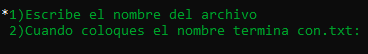

# Manual de usuario:

¡Bienvenido al manual de usuario! Aquí encontrarás toda la información necesaria para spoder utilizar el programa del proyecto final al máximo. 

* El programa te dara las siguientes alternativas las cuales son: 
1) Dibujar Un triangulo
2) Dibujar un Cuadrado
3) Dibujar un Rectangulo
4) Dibujar un Circulo
5) Dibujar una linea
6) Dibujar un Rombo
7) Dibujar un Hexagono
8) Cambiar el caracter en el cual se van a dibujar las figuras
9) Limpiar Toda la pantalla
10) Cambiar el color del caracter
11) Grabar la pantalla 
12) Abrir los archivos donde ya esten guardados los datos de nuestras figuras
13) Salir del programa

* Cuando abras el programa tenras las siguientes opciones: 

#### Opcion ( F1 ).  
Esta opcion permite al usuario poder dibujar un  Tiangulo, en este dibujo el programa te pedira: 
* Base
* Orientacion: 
1)  "a" = Arriba
2)  "b" = Abajo
3)  "d" = Derecha 
4)  "i" = Izquierda

Segun la base y orientacion ingresada asi se procedera a dibujar el triangulo. El puntero será la punta del triángulo y la longitud de sus
lados, será el tamaño automático de acuerdo a la longitud de su base.

#### Opcion ( F2 ). 
Esta opcion permite al usuario poder dibujar un Cuadrado, en este dibujo el programa te pedira: 
* Tamaño del lado del cuadrado
* Orientacion:
1)  "a" = Arriba
2)  "b" = Abajo
3)  "d" = Derecha 
4)  "i" = Izquierda

Segun el tamaño y orientcaion ingresada asi se procedera a dibujar el cuadrado en la pantalla.
El cuadrado se dibujará a partir de la posición del puntero en pantalla.

#### Opcion ( F3 ). 
Esta opcion permite al usuario poder dibujar un Rectangulo, en este dibujo el programa te pedira: 
* Ancho del Rectangulo
* Alto del Rectangulo
* Orientacion: 
1)  "a" = Arriba
2)  "b" = Abajo

Segun el Ancho y Alto ingresados se procedera a dibujar el Rectangulo en la pantalla. 
El rectángulo se dibujará a partir de la posición del puntero en pantalla la posición del puntero indicará la esquina superior izquierda del rectángulo, a partir
de allí se graficará la figura geométrica.

#### Opcion ( F4 ). 
Esta opcion permite al usuario poder dibujar un Cirulo, en este dibujo el programa te pedira lo siguiente: 
* Radio del Cirulo

Segun el radio ingresado ingresado se procedera a dibujar el Circulo en pantalla. 

El círculo se dibujará a partir de la posición del puntero en pantalla, la posición del
puntero será el centro del círculo.

#### Opcion ( F5 ). 
Esta opcion permite al usuario poder dibujar una Linea, en este dibujo el programa te pedira lo siguiente: 
* Longitud de la linea
* Orientacion: 
1) a: Arriba
 2) b: Abajo
 3) d: Derecha
 4) i: Izquierda
 5) q: Diagonal Izquierda Arriba
 6) e: Diagonal Derecha Arriba
 7) z: Diagonal Izquierda Abajo
 8) c: Diagonal Derecha Abajo

 Segun la longitud de la linea ingresada y la orientacion se dibujara la Linea en pantalla. 

 La  Linea se dibujará a partir de la posición del puntero en pantalla.

#### Opcion ( F6 ).
Esta opcion permite al usuario poder dibujar un Rombo, en este dibujo el programa te pedira lo siguiente: 
* Longitud del Rombo
* Orientacion: 
1) a: Arriba
2) b: Abajo

Segun la longitud del rombo ingresada y la orientacion se dibujara el rombo en pantalla. 

#### Opcion ( F7 ).
Esta opcion permite al usuario poder dibujar un Hexagono, en este dibujo el programa te pedira lo siguiente: 
* Tamaño de un lado del Hexagono 

Segun el tamaño ingresado de un lado del Hexagono procedera a dibujar la figura. 

#### Opcion ( F8 ).
Esta opcion permite al usuario poder cambiar de caracter el cual se va a utilizar para dibujar las figuras. 

Al seleccionar esta opcion el programa pedira lo siguiente: 
* Nuevo Caracter a Utilizar.

Al momento de seleccionar el caracter aparecera un mensaje en pantalla el cual indica que el caracter se ha cambiado. 

Al momento de seleccionar esta opcion permitira al usuario dibujar las figuras con el nuevo caracter el cual se escogio: 

#### Opcion ( F9 ).
Esta opcion permite al usuario poder borrar las figuras las cuales se encuentran en pantalla. 

Cuando el usuario seleccione esta opcion automaticamente todo las figuras que se encuentren en pantalla automaticamente se procederan a eliminarse. 
#### Opcion ( F10 ).
Esta opcion permite al usuario poder cambiar el color del caracter con el cual se van a dibujar las figuras. 

Esta opcion pedira al usuario los siguientes posibles colores: 

1) "1. Rojo" 
2) "2. Azul" 
3) "3. Verde" 
4) "4. Amarillo"
5) "5. Cian" 
6) "6. Magenta" 
7) "7. Blanco" 
8) "8. Gris" 

Al momento que selecciones una opcion aparecera el siguiente mensaje en pantlla:

Segun el color el cual ingreso el usuario aparecera el mensaje con el mismo color, listo para cuando dibujes la siguiente figura se dibuje de esa manera: 

#### Opcion ( F12 ).
Esta opcion permitira al usuario poder guardar todas las figuras las cuales se encuentren en la pantalla. 

Al momento que el usuario seleccione esta opcion aparecera el siguiente mensaje: 

En este punto debemos de colocar el nombre, seguido de la extension .txt 
Ejemplo:
* figuras.txt

Seguido de eso debemos de colocar la ruta, Ejemplo:
* ./ 
Que con esto le estamos diciendo que se guarde en la carpeta raiz del proyecto

Despues de esto despliegara que las figuras se guardaron correctamente. 

#### Opcion ( Ctrl + A ).

Esta opcion permite al usuario poder abrir los archivos .txt los cuales previamente ya guardamos. 

Pedira al usuario que ingrese la ruta del archivo seguido del nombre y la extension, Ejemplo: 

./varias.txt

Cuando el usuario cargue las figuras de esta manera automaticamente despliegara el siguiente mensaje: 

Despues de esto automaticamente se cargaran las figuras que se encuentren en el archivo. 

#### Opcion ( 9 ).
Esta opcion permite al usuario poder salir del programa. 

Cuando el usuario seleccione esta opcion saldra del programa desplegando un mensaje en pantalla: 

* En conclusión, este manual de usuario proporciona una guía completa para utilizar el programa de manera efectiva y eficiente. A través de instrucciones claras y detalladas. 
